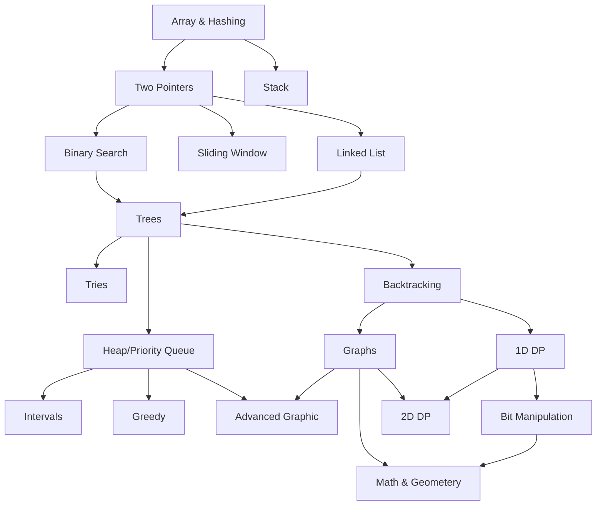

## Roadmap

Based on <https://neetcode.io/roadmap>, there are a lot of data structure and algorithm including their pattern to solve.
The first topic is about array and hashing and then continue to stack until cover all of [leetcode 75](https://leetcode.com/studyplan/leetcode-75/) or [neetcode 150](https://leetcode.com/problem-list/2hn8qkbs/) or [neetcode 250](https://neetcode.io/practice/practice/neetcode250)

Here is the roadmap



Another great roadmap to follow is from [algomonster](https://blog.algomaster.io/p/how-to-start-leetcode-in-2025)

| data structures     | algorithms            | problem-solving techniques |
| ------------------- | --------------------- | -------------------------- |
| arrays              | sorting               | two pointers               |
| linked lists        | searching             | sliding window             |
| stacks              | linear search         | prefix sum                 |
| queues              | binary search         | fast and slow pointers     |
| hash tables         | bit manipulation      | divide and conquer         |
| trees               | tree traversal        | greedy                     |
| binary search trees | in order              | recursion                  |
| heaps               | pre order             | backracking                |
| graphs              | post order            | dynamic programming        |
| trie                | graph algorithms      | top 'K' elements           |
| union find          | dfs/bfs               |                            |
|                     | topological sort      |                            |
|                     | shortest path         |                            |
|                     | minimum spanning tree |                            |

Let's start from the first topic, Array and Hashing

---

## Array & Hashing

| Problem                      | Difficulty |
| ---------------------------- | ---------- |
| Contains Duplicate           | Easy       |
| Valid Anagram                | Easy       |
| Two Sum                      | Easy       |
| Group Anagrams               | Medium     |
| Top K Frequent Elements      | Medium     |
| Encode and Decode Strings    | Medium     |
| Product of Array Except Self | Medium     |
| Longest Consecutive Sequence | Medium     |

## LeetCode 217: Contains Duplicate

1. Title & Problem Goal

- **Title:** 217. Contains Duplicate
- **Goal:** Given an integer array `nums`, return `true` if any value appears **at least twice** in the array, and return `false` if every element is distinct.

2. Analysis & Constraints

- **Input Size (𝑛):** Up to 105.
  - An 𝑂(𝑛^2) brute-force approach will exceed the time limit (10^10) operations).
  - We must aim for**𝑂(𝑛)** or **𝑂(𝑛log𝑛)**.
- **Value Range:** Numbers can be negative or positive up to 10^9.
  - Since values are large, we cannot use a simple frequency array (the array would be too big). A **Hash Set** is necessary for 𝑂(𝑛) performance. ---

3. Approaches Comparison Table

| Approach        | Logic                                                                             | Time Complexity | Space Complexity           | Pros/Cons                                         |
| --------------- | --------------------------------------------------------------------------------- | --------------- | -------------------------- | ------------------------------------------------- |
| **Brute Force** | Compare every pair using nested loops.                                            | 𝑂(𝑛^2)          | 𝑂(1)                       | Too slow for large inputs.                        |
| **Sorting**     | Sort the array and check if `nums[i] == nums[i+1]`.                               | 𝑂(𝑛log𝑛)        | 𝑂(1)<br><br>or<br><br>𝑂(𝑛) | Good if memory is extremely limited.              |
| **Hash Set**    | Store visited numbers in a set; if a number is already in the set, return `true`. | 𝑂(𝑛)            | 𝑂(𝑛)                       | **Fastest.** Standard choice for modern hardware. |

4. Testing Strategy

**Standard Cases:**

- `nums = [1, 2, 3, 1]` → `true` (1 is duplicated)
- `nums = [1, 2, 3, 4]` → `false` (all distinct)

**Edge Cases (Boundaries):**

- `nums = [1]` (Single element) → `false`
- `nums = [1, 1]` (Two identical elements) → `true`
- `nums = [-1, -1]` (Negative duplicates) → `true`

**Negative Cases:**

- `nums = []` (Empty array - if allowed by constraints) → `false`
- `nums = [1, 2, 3, 4, 5, 0]` (All unique including zero) → `false`

5. Optimal Code & Why (Golang)

**Why this is optimal:** The Hash Set (`map` in Go) provides 𝑂(1) average time complexity for both insertions and lookups. This allows us to solve the problem in a single linear pass.

```go
func containsDuplicate(nums []int) bool {
    // 1. Initialize a map to act as a Set
    // We use struct{} because it occupies zero bytes of memory
    visited := make(map[int]struct{})

    for _, n := range nums {
        // 2. Check if the number has been seen before
        if _, exists := visited[n]; exists {
            return true
        }
        // 3. Mark the number as visited
        visited[n] = struct{}{}
    }

    // 4. If the loop finishes, no duplicates were found
    return false
}
```

6. Reflection / Mistake Log

- **Memory Efficiency:** In Go, using `map[int]bool` is common, but `map[int]struct{}` is the 2025 standard for "Sets" because `struct{}` uses zero extra memory per entry compared to a boolean.
- **Time vs. Space:** If I were working in an embedded system with 1KB of RAM, I would choose the **Sorting** approach to keep space at 𝑂(1), even though it's slower (𝑂(𝑛log𝑛)).
- **Early Exit:** Always remember to return `true` the **moment** a duplicate is found. There is no need to keep checking the rest of the array.

---

## LeetCode 242: Valid Anagram

1. Title & Problem Goal

- **Title:** 242. Valid Anagram
- **Goal:** Determine if string `t` is a rearrangement of string `s`. Both must have the same characters with the same exact frequency.

1. Analysis & Constraints

- **Length (𝑛):** Up to 5×10^4  
   . This rules out 𝑂(𝑛^2) solutions; we need**𝑂(𝑛)** or **𝑂(𝑛log𝑛)**.
- **Character Set:** Lowercase English letters. This is a huge hint—since the set is small (26), we can use a fixed-size array instead of a full Hash Map to save overhead.
- **Memory:** Is there a way to solve this with 𝑂(1) extra space? (Only if we don't count the fixed 26-slot array).

3. Approaches Comparison Table

| Approach            | Logic                                                               | Time Complexity | Space Complexity | Pros/Cons                                     |
| ------------------- | ------------------------------------------------------------------- | --------------- | ---------------- | --------------------------------------------- |
| **Sorting**         | Sort both strings; compare if `sortedS == sortedT`.                 | 𝑂(𝑛log𝑛)        | 𝑂(1) or 𝑂(𝑛)     | Very easy to write; slower for large strings. |
| **Hash Map**        | Count chars in `s` (+), then in `t` (-). Check if all counts are 0. | 𝑂(𝑛)            | 𝑂(𝑘) (𝑘=26)      | Faster; works for Unicode (if using a Map).   |
| **Frequency Array** | Use an `int[26]` to track counts.                                   | 𝑂(𝑛)            | 𝑂(1)             | Most efficient for lowercase English letters. |

4. Testing Strategy

**Standard Cases:**

- `s = "anagram"`, `t = "nagaram"` → `true`
- `s = "rat"`, `t = "car"` → `false`

**Edge Cases (Boundaries):**

- `s = "a"`, `t = "a"` (Single character, same) → `true`
- `s = "a"`, `t = "b"` (Single character, different) → `false`
- `s = ""`, `t = ""` (Empty strings) → `true`

**Negative Cases:**

- `s = "aabb"`, `t = "ab"` (Different lengths) → `false`
- `s = "aabb"`, `t = "abbb"` (Same length, different frequencies) → `false`

5. Optimal Code & Why (Golang)

**Why this is optimal:** It uses a single pass to build counts and a fixed-size array. This avoids the overhead of a dynamic Hash Map and stays at 𝑂(𝑛) time.

```go
func isAnagram(s string, t string) bool {
    // 1. Length check is the fastest way to exit
    if len(s) != len(t) {
        return false
    }

    // 2. Use a fixed-size array (alphabet)
    // Space: O(1) because size 26 never changes
    alphabet := [26]int{}

    // 3. Single loop: increment for s, decrement for t
    // Time: O(n)
    for i := 0; i < len(s); i++ {
        alphabet[s[i]-'a']++
        alphabet[t[i]-'a']--
    }

    // 4. If all counts are zero, it's an anagram
    for _, count := range alphabet {
        if count != 0 {
            return false
        }
    }

    return true
}
```

6. Reflection / Mistake Log

- **Initial thought:** I considered using two separate maps, but that uses double the memory. Comparing and subtracting in one map/array is much cleaner.
- **Unicode Follow-up:** If the problem allowed Unicode characters (like `s = "你好"`, `t = "好你"`), the `[26]int` array would break. In that case, I would need to use `map[rune]int` to handle any possible character code.
- **Gotcha:** Remember that `s[i]` in Go returns a `byte`. Subtracting `'a'` (which is also a byte/rune) gives the correct 0-25 index.

---

## LeetCode 1: Two Sum

1. Title & Problem Goal

- **Title:** [1. Two Sum](https://leetcode.com/problems/two-sum/)
- **Goal:** Given an array of integers `nums` and an integer `target`, return indices of the two numbers such that they add up to `target`.
- **Conditions:** You must assume exactly one solution exists, you cannot use the same element twice, and you can return the answer in any order.

2. Analysis & Constraints

- **Target Efficiency:** Modern large-scale inputs (up to 10,000 items) make 𝑂(𝑛^2) impractical. We aim for **𝑂(𝑛)** using a hash table.
- **Memory:** Using a hash map trade-offs memory for speed, resulting in **𝑂(𝑛)** space complexity.
- **Key Insight:** For any number 𝑥, we are searching for its complement 𝑦 such that 𝑦=𝑡𝑎𝑟𝑔𝑒𝑡−𝑥.

3. Approaches Comparison Table

| Approach                | Logic                                                                    | Time Complexity | Space Complexity | Pros/Cons                                            |
| ----------------------- | ------------------------------------------------------------------------ | --------------- | ---------------- | ---------------------------------------------------- |
| **Brute Force**         | Nested loops check every pair (𝑖,𝑗).                                     | 𝑂(𝑛^2)          | 𝑂(1)             | Simple to implement but slow for large 𝑛.            |
| **Two-Pass Hash Table** | First pass builds map (value → index); second pass looks for complement. | 𝑂(𝑛)            | 𝑂(𝑛)             | Fast but requires two iterations over the data.      |
| **One-Pass Hash Table** | Check for complement _while_ building the map in a single pass.          | **𝑂(𝑛)**        | 𝑂(𝑛)             | **Most efficient.** Finds the pair in one traversal. |

4. Testing Strategy

**Standard Cases:**

- `nums = [2, 7, 11, 15], target = 9` → `[0, 1]` (Basic case).
- `nums = [3, 2, 4], target = 6` → `[1, 2]` (Target is sum of non-sequential elements).

**Edge Cases (Boundaries):**

- `nums = [3, 3], target = 6` → `[0, 1]` (Array with identical values).
- `nums = [10^9, -10^9], target = 0` (Large positive/negative integers).
- `nums = [5, -2, 8, 1], target = 6` (Negative numbers included).

**Negative Cases (Validation):**

- `nums = [1, 2, 3], target = 7` → (Should not happen per problem guarantee of one solution).

5. Optimal Code & Why (Golang)

**Why this is optimal:** The One-Pass Hash Table ensures we only traverse the array once (𝑂(𝑛)) and perform lookups in constant time (𝑂(1)) on average.

```go
func twoSum(nums []int, target int) []int {
    // 1. Create a map to store seen values and their indices
    // Key: Number value, Value: Index in the original array
    prevMap := make(map[int]int)

    for i, num := range nums {
        // 2. Calculate the required complement
        complement := target - num

        // 3. Check if complement was already encountered
        if index, exists := prevMap[complement]; exists {
            return []int{index, i}
        }

        // 4. Otherwise, store current number and its index
        prevMap[num] = i
    }

    return nil
}
```

6. Reflection / Mistake Log

- **Duplicate Values:** Initially, I worried about duplicate values overwriting indices in the map. However, the one-pass approach solves this: if a duplicate completes a sum, we find it _before_ we ever overwrite the previous entry.
- **Indices vs. Values:** A common mistake is returning the numbers themselves instead of their indices.
- **Sorted Data Misconception:** Some beginners try to sort the array first to use two-pointers. This is a mistake for this specific problem because sorting loses the original indices required for the output.

---

## LeetCode 49: Group Anagrams

 1. Title & Problem Goal

- **Title:** [49. Group Anagrams](https://leetcode.com/problems/group-anagrams/)
- **Goal:** Given an array of strings `strs`, group the **anagrams** together. You can return the answer in any order.
- **Key Insight:** Anagrams are words with the exact same character frequencies. If you "normalize" them (by sorting or counting), all words in an anagram group will produce the same "signature".

1. Analysis & Constraints

- **Target Efficiency:** For an input of 𝑁 strings with max length 𝐾, we aim for **𝑂(𝑁×𝐾)** or **𝑂(𝑁×𝐾log𝐾)**.
- **Constraints:**
  - 1≤𝑠𝑡𝑟𝑠.𝑙𝑒𝑛𝑔𝑡ℎ≤10^4
  - 0≤𝑠𝑡𝑟𝑠[𝑖].𝑙𝑒𝑛𝑔𝑡ℎ≤100
  - `strs[i]` consists of lowercase English letters.
- **Big O Goal:** Since 𝐾 is small (100) but 𝑁 is larger (10^4), an 𝑂(𝑁×𝐾) approach using character counting is typically the most optimized.

3. Approaches Comparison Table

| Approach                | Logic                                                                                    | Time Complexity | Space Complexity | Pros/Cons                                                   |
| ----------------------- | ---------------------------------------------------------------------------------------- | --------------- | ---------------- | ----------------------------------------------------------- |
| **Brute Force**         | Compare every pair of strings to see if they are anagrams.                               | 𝑂(𝑁^2×𝐾)        | 𝑂(1)             | Too slow for 𝑁=10^4.                                        |
| **Sorting**             | Sort each string alphabetically and use the sorted string as a Hash Map key.             | 𝑂(𝑁×𝐾log𝐾)      | 𝑂(𝑁×𝐾)           | Simple to implement; slightly slower due to sorting.        |
| **Categorize by Count** | Use a 26-element array to count char frequencies; use the array/tuple as a Hash Map key. | **𝑂(𝑁×𝐾)**      | **𝑂(𝑁×𝐾)**       | **Most optimized** as it avoids the 𝑂(𝐾log𝐾) sort per word. |

4. Testing Strategy

**Standard Cases:**

- `strs = ["eat","tea","tan","ate","nat","bat"]` → `[["bat"],["nat","tan"],["ate","eat","tea"]]`.

**Edge Cases (Boundaries):**

- `strs = [""]` (Empty string) → `[[""]]`.
- `strs = ["a"]` (Single character) → `[["a"]]`.
- `strs = ["a", "a", "a"]` (Identical strings) → `[["a", "a", "a"]]`.

**Negative/Special Cases:**

- `strs = ["abc", "def", "ghi"]` (No anagrams) → `[["abc"], ["def"], ["ghi"]]`.
- Strings with different lengths (Guaranteed not to be anagrams).

5. Optimal Code & Why (Golang)

**Why this is optimal:** This approach uses a fixed-size array (`[26]int`) to represent the character frequency of each word. Since arrays in Go are comparable, they can be used directly as map keys. This skips the 𝑂(𝐾log𝐾) sorting cost entirely.

```go
func groupAnagrams(strs []string) [][]string {
    // 1. Map to group words by their character count signature
    // Key: [26]int (count of each char a-z), Value: slice of original words
    groups := make(map[[26]int][]string)

    for _, s := range strs {
        // 2. Generate the "signature" for the current word
        var count [26]int
        for i := 0; i < len(s); i++ {
            count[s[i]-'a']++
        }

        // 3. Group words sharing the same signature
        groups[count] = append(groups[count], s)
    }

    // 4. Collect all groups into a list of lists
    result := make([][]string, 0, len(groups))
    for _, group := range groups {
        result = append(result, group)
    }

    return result
}
```

6. Reflection / Mistake Log

- **Key Comparison:** In Go, arrays (`[26]int`) are comparable and can be map keys, whereas slices (`[]int`) are not. This is a common point of confusion for beginners.
- **Memory Overhead:** While 𝑂(𝑁×𝐾) is the time complexity, the space complexity is also 𝑂(𝑁×𝐾) because we must store the output and the Hash Map.
- **Alphabet Limitation:** This optimized solution relies on the "lowercase English letters" constraint. If the input allowed Unicode/UTF-8, sorting the string might be safer or would require a more complex map key.

---

## LeetCode 347: Top K Frequent Elements

1. Title & Problem Goal

- **Title:** 347. Top K Frequent Elements
- **Goal:** Given an integer array `nums` and an integer `k`, return the `k` most frequent elements.
- **Condition:** You may return the answer in any order. The problem specifically asks for a solution better than 𝑂(𝑛log𝑛).

2. Analysis & Constraints

- **Target Efficiency:** The problem suggests better than 𝑂(𝑛log𝑛)  
   . This points toward **Bucket Sort (𝑂(𝑛))** or a **Min-Heap (𝑂(𝑛log𝑘))**.
- **Constraints:**
  - 1≤𝑛𝑢𝑚𝑠.𝑙𝑒𝑛𝑔𝑡ℎ≤10^5.
  - 𝑘 is in the range [1,number of unique elements].
  - It is guaranteed that the answer is unique.
- **Data Characteristics:** The maximum frequency any number can have is 𝑛 (the length of the array). This makes **Bucket Sort** extremely efficient because we can create an array of "buckets" indexed by frequency.

3. Approaches Comparison Table

| Approach        | Logic                                                                              | Time Complexity | Space Complexity | Pros/Cons                                                       |
| --------------- | ---------------------------------------------------------------------------------- | --------------- | ---------------- | --------------------------------------------------------------- |
| **Sorting**     | Count frequencies, then sort the list of unique elements by frequency.             | 𝑂(𝑛log𝑛)        | 𝑂(𝑛)             | Simple but doesn't meet the "better than 𝑂(𝑛log𝑛)" requirement. |
| **Min-Heap**    | Count frequencies, push into a heap of size 𝑘. Pop the smallest if size exceeds 𝑘. | 𝑂(𝑛log𝑘)        | 𝑂(𝑛)             | Good if 𝑘 is much smaller than 𝑛.                               |
| **Bucket Sort** | Map values to frequencies, then use frequencies as indices in an array of lists.   | **𝑂(𝑛)**        | **𝑂(𝑛)**         | **Most optimized.** Linear time regardless of 𝑘.                |

---

4. Testing Strategy

**Standard Cases:**

- `nums = [1,1,1,2,2,3], k = 2` → `[1, 2]`
- `nums = [1], k = 1` → `[1]`

**Edge Cases (Boundaries):**

- `k = nums.length` (All elements are unique and requested) → `[1, 2, 3...]`
- `nums = [1, 1, 1, 1]` (All elements are the same) → `[1]`
- `nums = [-1, -1, 2, 2], k = 2` (Negative numbers) → `[-1, 2]`

**Negative/Special Cases:**

- Array where multiple numbers have the same frequency, but 𝑘 only asks for one (The problem guarantees a unique answer for 𝑘, but code should be robust).

5. Optimal Code & Why (Golang)

**Why this is optimal:** This is the **Bucket Sort** approach. By using the frequency as an index, we avoid any sorting or heap overhead. We simply iterate backward from the highest possible frequency until we collect 𝑘 elements.

```go
func topKFrequent(nums []int, k int) []int {
    // 1. Count frequencies: O(n)
    counts := make(map[int]int)
    for _, num := range nums {
        counts[num]++
    }

    // 2. Create buckets where index = frequency: O(n)
    // bucket[i] contains all numbers that appear i times
    buckets := make([][]int, len(nums)+1)
    for num, freq := range counts {
        buckets[freq] = append(buckets[freq], num)
    }

    // 3. Iterate backwards from highest frequency: O(n)
    result := make([]int, 0, k)
    for i := len(buckets) - 1; i >= 0 && len(result) < k; i-- {
        if len(buckets[i]) > 0 {
            result = append(result, buckets[i]...)
        }
    }

    // Return exactly k elements (in case bucket contained more than needed)
    return result[:k]
}
```

6. Reflection / Mistake Log

- **The "Better than 𝑂(𝑛log𝑛)" Trap:** Many developers instinctively reach for a Heap because it is the standard "Top K" solution. However, for this specific problem, **Bucket Sort** is superior (𝑂(𝑛)) because the range of possible frequencies (0 to 𝑛) is finite and small.
- **Memory Usage:** Bucket sort uses a `[][]int`. In the worst case (all numbers unique), this consumes 𝑂(𝑛) space. While the Big O is the same as the Heap, the actual memory footprint is slightly higher.
- **Index Out of Bounds:** A common mistake is making the bucket array size `len(nums)`. Since a number can appear `len(nums)` times, the array must be size `len(nums) + 1` to accommodate that index.
- **2025 Tip:** In performance-critical Go, pre-allocating the `result` slice capacity `make([]int, 0, k)` avoids unnecessary re-allocations during the final collection phase.

---

## LeetCode 271: Encode and Decode Strings

1. Title & Problem Goal

- **Title:** 271. Encode and Decode Strings (Premium)
- **Goal:** Design an algorithm to encode a list of strings into a single string. This encoded string is then sent over a network and must be decoded back into the original list of strings.
- **Key Challenge:** Handling any possible 256 ASCII characters within the strings without causing delimiter collisions (e.g., if you use a comma as a separator, what happens if a string contains a comma?).

1. Analysis & Constraints

- **Input Size (𝑁):** Up to 200 strings, with each string up to 200 characters long. Total characters 𝑀≈40,000.
- **Target Efficiency:** Must be**𝑂(𝑀)** time for both encoding and decoding to handle real-time data transmission efficiently.
- **Character Set:** All 256 valid ASCII characters.
- **Statelessness:** The solution must not store any external state between encode and decode operations.

3. Approaches Comparison Table

| Approach                      | Logic                                                                                                           | Time Complexity | Space Complexity | Pros/Cons                                                         |
| ----------------------------- | --------------------------------------------------------------------------------------------------------------- | --------------- | ---------------- | ----------------------------------------------------------------- |
| **Non-ASCII Delimiter**       | Use a character outside the standard 256 range.                                                                 | 𝑂(𝑀)            | 𝑂(𝑀)             | Simple, but fails if the environment strictly requires ASCII.     |
| **Escaping**                  | Choose a delimiter and "escape" it whenever it appears in the input.                                            | 𝑂(𝑀)            | 𝑂(𝑀)             | Conceptually like CSV; logic for nested escaping can get complex. |
| **Length Prefix + Delimiter** | Prefix each string with its `length` + `#`. To decode, read the length, skip `#`, and take 𝐿<br><br>characters. | **𝑂(𝑀)**        | **𝑂(𝑀)**         | **Most Robust.** Guaranteed to work regardless of string content. |
| **Chunked Encoding**          | Use a fixed 4-byte string for length (e.g., `0005hello`).                                                       | 𝑂(𝑀)            | 𝑂(𝑀)             | Very fast decoding; mimics HTTP/1.1 chunked transfer.             |

4. Testing Strategy

**Standard Cases:**

- `strs = ["Hello", "World"]` → `"5#Hello5#World"`.
- `strs = [""]` (Empty string in list) → `"0#"`.

**Edge Cases (Boundaries):**

- `strs = []` (Empty input list) → Resulting in an empty string `""`.
- **Delimiter as Content:** `strs = ["#", "4#word"]` (Strings containing the `#` character or looking like a prefix).
- **Numbers as Content:** `strs = ["123", "0"]` (Strings containing only digits).

**Negative Cases:**

- Strings with all 256 ASCII characters, including control characters and null bytes.

5. Optimal Code & Why (Golang)

**Why this is optimal:** The `length + delimiter` pattern is the gold standard for serialization (like Protobuf or gRPC) because it avoids scanning the entire string for "escaped" characters during decoding. You jump directly to the next word based on its known length.

```go
type Codec struct{}

// Encode converts a list of strings to a single string
func (c *Codec) Encode(strs []string) string {
    var encoded strings.Builder
    for _, s := range strs {
        // Format: [length]#[string]
        encoded.WriteString(strconv.Itoa(len(s)))
        encoded.WriteByte('#')
        encoded.WriteString(s)
    }
    return encoded.String()
}

// Decode converts a single string back to a list of strings
func (c *Codec) Decode(s string) []string {
    var res []string
    i := 0
    for i < len(s) {
        // 1. Find the delimiter to determine where the length ends
        j := i
        for s[j] != '#' {
            j++
        }

        // 2. Parse the length
        length, _ := strconv.Atoi(s[i:j])

        // 3. Extract the string of the given length
        start := j + 1
        end := start + length
        res = append(res, s[start:end])

        // 4. Move pointer to the start of the next length prefix
        i = end
    }
    return res
}
```

6. Reflection / Mistake Log

- **Finding the Delimiter:** In the `Decode` function, you must only search for the _first_ `#` starting from the current index `i`. Any `#` _inside_ the actual string content is safely ignored because the pointer jumps over it using the `length`.
- **Performance:** Using `strings.Builder` in Go is essential for 𝑂(𝑀) encoding; standard string concatenation `s += next` would lead to 𝑂(𝑀^2) due to repeated allocations.
- **Stateless Requirement:** Ensure you don't use global variables to track string counts between calls; the encoded string must contain all metadata needed for its own decoding.

---

## LeetCode 238: Product of Array Except Self

1. Title & Problem Goal

- **Title:** [238. Product of Array Except Self](https://leetcode.com/problems/product-of-array-except-self/)
- **Goal:** Given an integer array `nums`, return an array `answer` such that `answer[i]` is equal to the product of all the elements of `nums` except `nums[i]`.
- **Constraint:** You **must** solve it in 𝑂(𝑛) time and **without** using the division operation.

2. Analysis & Constraints

- **Time Complexity Requirement:** 𝑂(𝑛)  
   . This implies we cannot use nested loops (𝑂(𝑛^2)).
- **Space Complexity Requirement:** 𝑂(1) extra space (excluding the output array) is the target for an optimal solution.
- **Value Constraints:** `nums[i]` is between -30 and 30. The product is guaranteed to fit in a 32-bit integer.
- **No Division:** The most obvious 𝑂(𝑛) solution—multiplying all numbers and dividing by each element—is explicitly forbidden.

3. Approaches Comparison Table

| Approach                       | Logic                                                                                     | Time Complexity | Space Complexity | Pros/Cons                                           |
| ------------------------------ | ----------------------------------------------------------------------------------------- | --------------- | ---------------- | --------------------------------------------------- |
| **Brute Force**                | Nested loops: for each `i`, multiply all other elements.                                  | 𝑂(𝑛2)           | 𝑂(1)             | Simple but too slow for 𝑛=10^5.                     |
| **Division**                   | Multiply all, then divide `total / nums[i]`.                                              | 𝑂(𝑛)            | 𝑂(1)             | **Forbidden** by problem; fails if array has zeros. |
| **Prefix & Suffix Arrays**     | Precalculate prefix and suffix product arrays and multiply them.                          | 𝑂(𝑛)            | 𝑂(𝑛)             | Clean logic; uses extra 𝑂(𝑛) memory for two arrays. |
| **Two-Pass (Space Optimized)** | Calculate prefixes into the result array, then multiply suffixes using a single variable. | **𝑂(𝑛)**        | **𝑂(1)**         | **Most Optimized.** Meets all constraints.          |

4. Testing Strategy

**Standard Cases:**

- `nums = [1, 2, 3, 4]` → `[24, 12, 8, 6]`
- `nums = [2, 3, 1, 5, 2]` → `[30, 20, 60, 12, 30]`

**Edge Cases (Zeros):**

- **Single Zero:** `nums = [-1, 1, 0, -3, 3]` → `[0, 0, 9, 0, 0]`. Only the zero-index has a non-zero product.
- **Multiple Zeros:** `nums = [0, 1, 0]` → `[0, 0, 0]`. All products will be zero.

**Boundaries & Negatives:**

- **Negatives:** `nums = [-1, -2, -3, -4]` → `[-24, -12, -8, -6]`.
- **Min Length:** `nums = [1, 2]`.

5. Optimal Code & Why (Golang)

**Why this is optimal:** This approach avoids extra arrays by storing prefix products directly in the `ans` array during the first pass. A second backward pass uses a single integer variable (`suffix`) to maintain the running product from the right, satisfying the 𝑂(1) extra space requirement.

```go
func productExceptSelf(nums []int) []int {
    n := len(nums)
    ans := make([]int, n)

    // 1. Prefix pass: ans[i] stores product of all elements to the left
    ans[0] = 1
    for i := 1; i < n; i++ {
        ans[i] = ans[i-1] * nums[i-1]
    }

    // 2. Suffix pass: multiply prefix with running suffix product
    suffix := 1
    for i := n - 1; i >= 0; i-- {
        ans[i] *= suffix
        suffix *= nums[i]
    }

    return ans
}
```

6. Reflection / Mistake Log

- **Zeros Handling:** Without division, zeros are naturally handled by the prefix/suffix multiplication. If you used division, a single zero would require a special case, and multiple zeros would break it entirely.
- **The "Output Array" Rule:** Remember that in LeetCode complexity analysis, the space used for the **output array** usually does not count as "extra space".
- **Initialization:** For prefix/suffix multiplication, always start the running product variable at `1`, not `0`, to avoid zeroing out your entire result.

---

## LeetCode 128: Longest Consecutive Sequence

1. Title & Problem Goal

- **Title:** 128. Longest Consecutive Sequence
- **Goal:** Given an unsorted array of integers `nums`, find the length of the longest consecutive elements sequence.
- **Condition:** The algorithm must run in **𝑂(𝑛)** time.

2. Analysis & Constraints (2025 Data)

- **Input Size (𝑛):** Up to 10^5.
  - 𝑂(𝑛2) is impossible (10^10ops).
  - 𝑂(𝑛log𝑛) (sorting) is usually accepted by the judge but technically violates the problem's 𝑂(𝑛) requirement.
- **Value Range:** −10^9 to 10^9. Because values are so spread out, we cannot use a frequency array or a bucket; we must use a **Hash Set**.
- **Key Insight:** A number 𝑥 is the **start** of a sequence if 𝑥−1 does not exist in the set. If 𝑥−1 exists, we ignore 𝑥 and wait until we find the actual start.

3. Approaches Comparison Table

| Approach               | Logic                                                                           | Time Complexity  | Space Complexity | Pros/Cons                                                 |
| ---------------------- | ------------------------------------------------------------------------------- | ---------------- | ---------------- | --------------------------------------------------------- |
| **Brute Force**        | For each number, search for 𝑛+1,𝑛+2… linearly.                                  | 𝑂(𝑛^3) or 𝑂(𝑛^2) | 𝑂(1)             | Extremely slow.                                           |
| **Sorting**            | Sort the array and iterate to find the longest streak.                          | 𝑂(𝑛log𝑛)         | 𝑂(1) or 𝑂(𝑛)     | Easy to implement; violates 𝑂(𝑛) requirement.             |
| **Hash Set (Optimal)** | Store all numbers in a Set. Only start counting if `num - 1` is not in the set. | **𝑂(𝑛)**         | **𝑂(𝑛)**         | **Most Optimized.** Each number is visited at most twice. |

4. Testing Strategy

**Standard Cases:**

- `nums = [100, 4, 200, 1, 3, 2]` → `4` (Sequence: `[1, 2, 3, 4]`).
- `nums = [0, 3, 7, 2, 5, 8, 4, 6, 0, 1]` → `9` (Sequence: `[0-8]`).

**Edge Cases (Boundaries):**

- `nums = []` (Empty array) → `0`.
- `nums = [5]` (Single element) → `1`.
- `nums = [1, 1, 1]` (All duplicates) → `1`.

**Negative Cases:**

- `nums = [-1, -2, -3, 0, 1]` → `5`.
- `nums = [10, 20, 30]` (No consecutive elements) → `1`.

5. Optimal Code & Why (Golang)

**Why this is optimal:** By checking `!set[n-1]`, we ensure that we only start the inner `while` loop for the **first** element of any sequence. Even though there is a nested loop, each element is touched a constant number of times across the entire runtime, maintaining **𝑂(𝑛)**.

```go
func longestConsecutive(nums []int) int {
 if len(nums) == 0 {
  return 0
 }

 // 1. Create a Set (map in Go) for O(1) lookups
 set := make(map[int]struct{})
 for _, n := range nums {
  set[n] = struct{}{}
 }

 longest := 0

 // 2. Iterate through the set (to skip duplicates automatically)
 for n := range set {
  // 3. Check if 'n' is the START of a sequence
  // If n-1 exists, 'n' is NOT the start, so we skip it
  if _, hasLeft := set[n-1]; !hasLeft {
   currentNum := n
   currentStreak := 1

   // 4. Count how far the sequence goes
   for {
    if _, hasRight := set[currentNum+1]; hasRight {
     currentNum++
     currentStreak++
    } else {
     break
    }
   }

   // 5. Update global maximum
   if currentStreak > longest {
    longest = currentStreak
   }
  }
 }

 return longest
}
```

6. Reflection / Mistake Log

- **The "Start Only" Optimization:** The most common mistake is starting a count for _every_ number in the array. This leads to 𝑂(𝑛2) if you have a sequence like `[10, 9, 8...1]`. The `if !set[n-1]` check is what makes this 𝑂(𝑛).
- **Duplicates:** Using a `map` as a set naturally handles duplicates. In the sorting approach, you have to manually handle cases where `nums[i] == nums[i-1]` to avoid breaking the streak or over-counting.
- **Go Memory Tip:** For 2025 high-performance Go, `map[int]struct{}` is preferred over `map[int]bool` because `struct{}` (the empty struct) has a size of 0 bytes, making the set more memory-efficient. The Go Memory Model ensures this efficiency.

---
