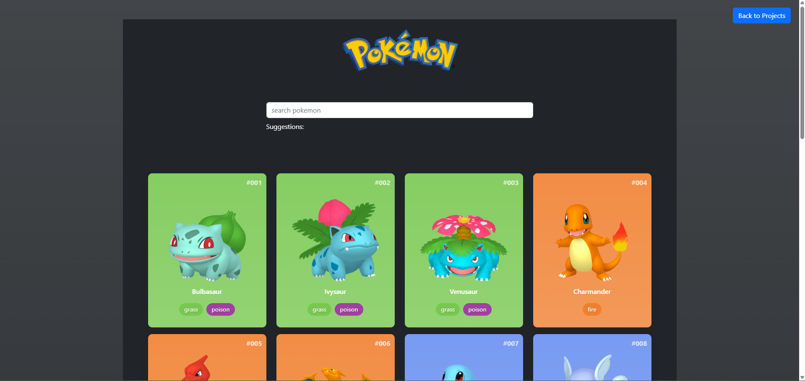
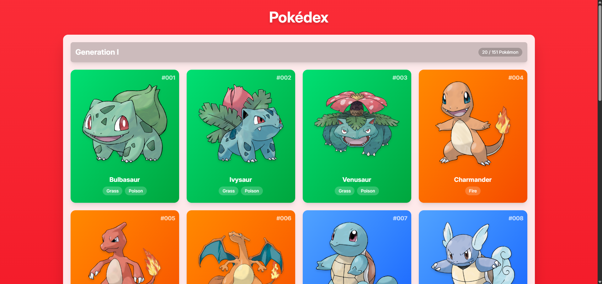

## 📝 Todo App with HTMX and Go

> A lightweight, fast Todo application built with Go and HTMX, featuring a clean dark theme UI and real-time updates.

- **🛠️ Tech Stack**: Go, HTMX, PostgreSQL, TailwindCSS
- **🔗 Links**:
  - [Source Code](https://github.com/afasari/go-workspace/tree/main/Projects/todo-htmx)

## 🎮 Pokedex Vue

> Modern Pokédex application showcasing Vue 3 capabilities with elegant UI and seamless PokeAPI integration.

- **🛠️ Tech Stack**: Vue 3, Vite, TailwindCSS, PokeAPI
- **🔗 Links**:
  - [Source Code](https://github.com/afasari/vue-workspace/tree/main/vue-vite-pokedex)
  - [Live Demo](https://afasari.github.io/vue-workspace/vue-vite-pokedex)

## ⚛️ Pokedex React

> TypeScript-powered Pokédex with React, featuring modern UI and comprehensive Pokémon data.

- **🛠️ Tech Stack**: React, TypeScript, TailwindCSS, PokeAPI
- **🔗 Links**:
  - [Source Code](https://github.com/afasari/react-workspace/tree/main/pokedex)

## 🦀 Todo App with Rust

> Command-line Todo application demonstrating Rust's performance and safety features.

- **🛠️ Tech Stack**: Rust, SQLite
- **🔗 Links**:
  - [Source Code](https://github.com/afasari/rust-workspace/tree/main/todo)

---

## 📚 Other Projects



  

  <a href="https://github.com/afasari?tab=repositories" target="_blank" class="github-button">
    <svg height="16" viewBox="0 0 16 16" width="16" class="github-icon">
      <path fill="currentColor" d="M8 0C3.58 0 0 3.58 0 8c0 3.54 2.29 6.53 5.47 7.59.4.07.55-.17.55-.38 0-.19-.01-.82-.01-1.49-2.01.37-2.53-.49-2.69-.94-.09-.23-.48-.94-.82-1.13-.28-.15-.68-.52-.01-.53.63-.01 1.08.58 1.23.82.72 1.21 1.87.87 2.33.66.07-.52.28-.87.51-1.07-1.78-.2-3.64-.89-3.64-3.95 0-.87.31-1.59.82-2.15-.08-.2-.36-1.02.08-2.12 0 0 .67-.21 2.2.82.64-.18 1.32-.27 2-.27.68 0 1.36.09 2 .27 1.53-1.04 2.2-.82 2.2-.82.44 1.1.16 1.92.08 2.12.51.56.82 1.27.82 2.15 0 3.07-1.87 3.75-3.65 3.95.29.25.54.73.54 1.48 0 1.07-.01 1.93-.01 2.2 0 .21.15.46.55.38A8.013 8.013 0 0016 8c0-4.42-3.58-8-8-8z"></path>
    </svg>
    See More on GitHub
  </a>


